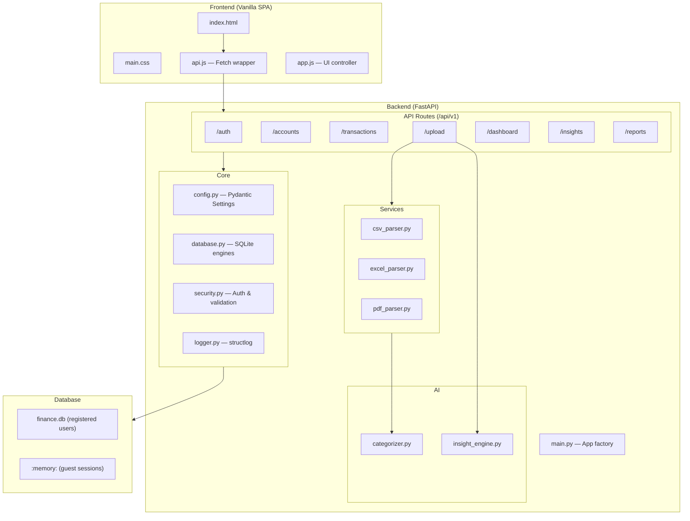
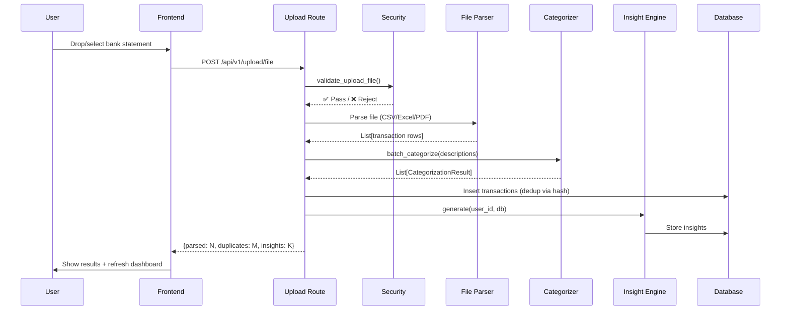

# Finance-AI — Project Walkthrough

## Overview

**Finance-AI** is a **privacy-first, local-first, AI-powered personal finance system**. It runs entirely on the user's machine with no cloud dependency. Users upload bank statements (CSV, Excel, PDF), and the system automatically categorizes transactions, generates financial insights, and provides a dashboard with KPIs and charts.

---

## Tech Stack

| Layer | Technology |
|-------|-----------|
| Backend | **Python 3.11**, **FastAPI**, **Uvicorn** |
| Database | **SQLite** (plain, with SQLCipher planned for Phase 2) |
| ORM | **SQLAlchemy 2.0** declarative style + **Alembic** migrations |
| AI (Phase 1) | Rule-based keyword categorizer |
| AI (Phase 2 stub) | scikit-learn (TF-IDF + Logistic Regression) |
| File Parsing | **pandas**, **pdfplumber**, **openpyxl** |
| Security | **bcrypt** (PIN hashing), **HMAC-SHA256** (session tokens) |
| Frontend | **Vanilla HTML/CSS/JS** + **Chart.js** |
| Logging | **structlog** (JSON/console) |
| Container | **Docker** + **docker-compose** |

---

## Architecture



---

## Project Structure

```
finance-ai/
├── backend/
│   ├── main.py                  # FastAPI app factory, lifespan, middleware
│   ├── core/
│   │   ├── config.py            # Pydantic Settings (.env validated)
│   │   ├── database.py          # Dual SQLite engines + session factory
│   │   ├── logger.py            # structlog configuration
│   │   └── security.py          # PIN, tokens, file validation, sanitization
│   ├── models/                  # 8 SQLAlchemy ORM models
│   │   ├── user.py              # User with phone/PIN auth
│   │   ├── account.py           # Bank/wallet accounts
│   │   ├── transaction.py       # Core financial records
│   │   ├── category.py          # Transaction categories (11 defaults)
│   │   ├── session.py           # Session tracking
│   │   ├── insight.py           # AI-generated insights
│   │   ├── reminder.py          # Bill reminders
│   │   └── upload_log.py        # Upload audit trail
│   ├── api/
│   │   ├── routes/              # 7 API route modules
│   │   └── middleware/
│   │       └── rate_limiter.py  # Request rate limiting
│   ├── services/file_parser/
│   │   ├── csv_parser.py        # Multi-bank CSV parsing (HDFC, SBI, ICICI, Axis, Kotak)
│   │   ├── excel_parser.py      # .xlsx → delegates to CSV pipeline
│   │   └── pdf_parser.py        # pdfplumber table extraction
│   └── ai/
│       ├── categorizer.py       # Rule-based + ML stub categorizer
│       └── insight_engine.py    # 7 financial insight analyzers
├── frontend/
│   ├── index.html               # SPA shell (auth + dashboard screens)
│   ├── main.css                 # Dark theme design system
│   ├── api.js                   # Fetch wrapper with session token injection
│   └── app.js                   # UI controller + Chart.js rendering
├── database/
│   ├── finance.db               # Persistent SQLite DB
│   └── migrations/              # Alembic migration files
├── tests/
│   ├── unit/                    # 5 unit test modules
│   └── integration/             # 6 integration test modules
├── scripts/                     # Utility/startup scripts
├── config/                      # Configuration files
├── docker-compose.yml           # Development Docker setup
├── docker-compose.prod.yml      # Production Docker setup
├── Dockerfile
├── requirements.txt             # Python dependencies
└── .env                         # Environment configuration
```

---

## Module Deep-Dive

### 1. Core — [config.py](file:///c:/Users/sachi/OneDrive/Desktop/JS/finance-ai/backend/core/config.py)

- Uses **Pydantic Settings** to read from `.env` with full validation at startup
- Key settings: database paths, security keys (min 32 chars), upload limits, logging config
- Properties: `is_development`, `is_production`, `cloud_enabled`, `allowed_ext_set`
- Singleton via `@lru_cache` — `get_settings()`

### 2. Core — [database.py](file:///c:/Users/sachi/OneDrive/Desktop/JS/finance-ai/backend/core/database.py)

- **Dual-engine architecture**:
  - **Registered users** → persistent SQLite file (`database/finance.db`) with WAL mode
  - **Guest sessions** → in-memory SQLite (`StaticPool`) wiped on session end
- SQLite PRAGMAs: foreign keys ON, WAL journal, 64MB cache, temp in memory
- FastAPI dependencies: `get_db()` / `get_guest_db()` for DI
- Context manager `db_session()` for scripts/services outside FastAPI

### 3. Core — [security.py](file:///c:/Users/sachi/OneDrive/Desktop/JS/finance-ai/backend/core/security.py)

- **PIN security**: bcrypt with 12 rounds
- **Session tokens**: `{random_hex}.{user_id}.{expiry}.{hmac_signature}`
- **File validation**: extension check, size limit, magic byte verification (PDF/XLSX), path traversal protection
- **Phone validation**: Indian mobile number format (+91)
- **CSV injection protection**: neutralizes formula prefixes (`=`, `+`, `-`, `@`, etc.)
- **Transaction dedup**: SHA-256 hash of `(account_id, date, amount, description, type)`

### 4. Models (8 Tables)

| Model | Key Fields | Notes |
|-------|-----------|-------|
| **User** | phone, pin_hash, display_name, monthly_budget | Phone-based auth, unique phone |
| **Account** | user_id, name, type, bank_name, balance | Types: savings, current, credit_card, wallet |
| **Transaction** | account_id, date, amount, type, category, hash | Debit/credit, SHA-256 dedup hash |
| **Category** | name, parent_category, color, is_system | 11 seeded defaults |
| **Session** | user_id, token, is_guest, expires_at | HMAC-signed tokens |
| **Insight** | user_id, insight_type, title, body, severity | AI-generated per period |
| **Reminder** | user_id, title, due_date, amount | Bill reminders |
| **UploadLog** | user_id, filename, file_hash, status, parsed_count | Upload audit trail |

### 5. API Routes

| Route Module | Prefix | Key Endpoints |
|-------------|--------|--------------|
| [auth.py](file:///c:/Users/sachi/OneDrive/Desktop/JS/finance-ai/backend/api/routes/auth.py) | `/api/v1/auth` | Register, Login, Guest session, Logout, PIN change |
| [accounts.py](file:///c:/Users/sachi/OneDrive/Desktop/JS/finance-ai/backend/api/routes/accounts.py) | `/api/v1/accounts` | CRUD for financial accounts |
| [transactions.py](file:///c:/Users/sachi/OneDrive/Desktop/JS/finance-ai/backend/api/routes/transactions.py) | `/api/v1/transactions` | List (paginated), search, filter, edit |
| [upload.py](file:///c:/Users/sachi/OneDrive/Desktop/JS/finance-ai/backend/api/routes/upload.py) | `/api/v1/upload` | File ingestion pipeline (CSV/Excel/PDF) |
| [dashboard.py](file:///c:/Users/sachi/OneDrive/Desktop/JS/finance-ai/backend/api/routes/dashboard.py) | `/api/v1/dashboard` | KPI summary, trends, heatmap |
| [insights.py](file:///c:/Users/sachi/OneDrive/Desktop/JS/finance-ai/backend/api/routes/insights.py) | `/api/v1/insights` | AI-generated insights retrieval |
| [reports.py](file:///c:/Users/sachi/OneDrive/Desktop/JS/finance-ai/backend/api/routes/reports.py) | `/api/v1/reports` | Financial reports |

### 6. File Parsers

- **csv_parser.py** — Multi-bank format detection (HDFC, SBI, ICICI, Axis, Kotak). Auto-detects columns.
- **excel_parser.py** — Converts `.xlsx` to DataFrame via openpyxl, then delegates to CSV pipeline.
- **pdf_parser.py** — Uses pdfplumber for table extraction from bank statement PDFs.

### 7. AI Modules

#### [categorizer.py](file:///c:/Users/sachi/OneDrive/Desktop/JS/finance-ai/backend/ai/categorizer.py) — Transaction Categorizer

- **Rule-based engine** with keyword taxonomy covering 10 categories (Food, Travel, Shopping, Bills, Health, Entertainment, Finance, Transfer, Income, Other)
- Merchant detection (Swiggy, Zomato, Amazon, Uber, etc.)
- Text normalization: Unicode NFKC → lowercase → strip non-alphanumeric
- **Facade pattern**: `TransactionCategorizer` tries ML first (if model loaded & confidence ≥ 0.6), falls back to rules
- ML stub ready for scikit-learn joblib models

#### [insight_engine.py](file:///c:/Users/sachi/OneDrive/Desktop/JS/finance-ai/backend/ai/insight_engine.py) — 7 Independent Analyzers

| # | Analyzer | What It Does |
|---|---------|-------------|
| 1 | **SpendingTrendAnalyzer** | Month-over-month category comparison, flags >20% increases |
| 2 | **AnomalyDetector** | Median-based unusual transaction detection (3x median threshold) |
| 3 | **TopCategoryAnalyzer** | Reports highest spending category this month |
| 4 | **HealthScoreAnalyzer** | Financial health score 0-100 based on savings rate |
| 5 | **SpendingPredictor** | Linear extrapolation for month-end spend estimate |
| 6 | **SavingsAnalyzer** | Savings rate assessment with qualitative feedback |
| 7 | **BudgetAnalyzer** | Budget vs actual comparison (if budget set) |

Design: Each analyzer is independent — one failure does not block others. Insights are idempotent per period.

### 8. Frontend

- **Single Page Application** with two screens: Auth and Dashboard
- **Auth screen**: Login (phone + PIN), Register, Guest mode tabs
- **Dashboard screen** with sidebar navigation:
  - **Overview**: KPI cards (income, expenses, savings, health score) + Chart.js charts (category donut, trend line)
  - **Transactions**: Searchable, filterable, paginated table
  - **Accounts**: Account management grid
  - **Upload**: Drag-and-drop file upload with progress bar
  - **Insights**: AI-generated financial insights list
- Modal system, toast notifications
- Dark theme design system

---

## Data Flow — File Upload Pipeline



---

## Security Model

| Control | Implementation |
|---------|---------------|
| PIN storage | bcrypt (12 rounds) |
| Session tokens | HMAC-SHA256 signed, 24h expiry |
| File upload | Extension + magic bytes + size + path traversal check |
| CSV injection | Formula prefix neutralization |
| Guest data | In-memory SQLite, wiped on session end + atexit |
| CORS | Localhost origins only |
| Security headers | CSP, X-Frame-Options, X-Content-Type-Options, Referrer-Policy, Permissions-Policy |
| Rate limiting | Custom middleware |
| Transaction dedup | SHA-256 hash on (account, date, amount, desc, type) |

---

## Known Issue — CSP Header Bug

> [!WARNING]
> The app has a **runtime error** that crashes every HTTP request.

The error in [uvicorn_error.txt](file:///c:/Users/sachi/OneDrive/Desktop/JS/finance-ai/uvicorn_error.txt) is:

```
h11._util.LocalProtocolError: Illegal header value b"default-src 'self'; 
script-src 'self' 'unsafe-inline' https://cdn.jsdelivr.net https://fastapi.tiangolo.com; 
style-src 'self' 'unsafe-inline' https://cdn.jsdelivr.net; 
img-src 'self' data: https://fastapi.tiangolo.com; 
font-src 'self' https://cdn.jsdelivr.net; "
```

**Root cause**: The `Content-Security-Policy` header value has a **trailing space after the semicolon** at the end, which `h11` (the HTTP library used by Uvicorn) rejects as an illegal header value. 

**Location**: [main.py line 210-215](file:///c:/Users/sachi/OneDrive/Desktop/JS/finance-ai/backend/main.py#L210-L215) — the `security_headers_middleware`.

> [!NOTE]
> The current code in `main.py` appears to have been **partially fixed** (the `fastapi.tiangolo.com` and `font-src` directives from the error log are no longer present), but the error log in `uvicorn_error.txt` still reflects the old broken version. The fix may have already been applied.

---

## How to Run

```bash
# 1. Create and activate venv
python -m venv venv
venv\Scripts\activate          # Windows

# 2. Install dependencies
pip install -r requirements.txt

# 3. Configure
# .env is already present with dev defaults

# 4. Run
uvicorn backend.main:app --host 127.0.0.1 --port 8000 --reload
```

Open: **http://127.0.0.1:8000**

---

## Roadmap

| Phase | Status | Features |
|-------|--------|---------|
| 1 — MVP | ✅ Built | CSV upload, categorization, dashboard, auth, guest mode |
| 2 — Core | 🔜 Next | Excel/PDF polish, multi-account analytics, ML categorizer |
| 3 — AI | 🔜 Future | Anomaly detection, spending forecast, financial health alerts |
| 4 — Cloud | 🔜 Future | Optional cloud backup, OTP auth, multi-device sync |
| 5 — Hybrid | 🔜 Future | Local + cloud, offline-first sync |
